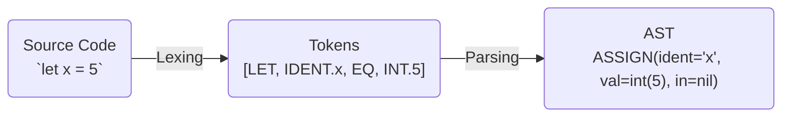

# Lexing

We lex/tokenize the input to represent source code in a form that is easier to work with.

The input to the lexer is the source code, the output is a stream of tokens. A token is an interpreted atom of source code (it has converted the raw text to something meaningful).